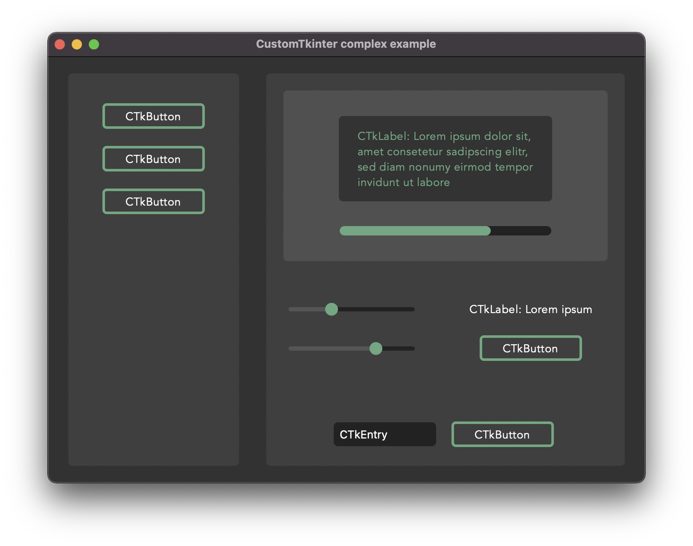
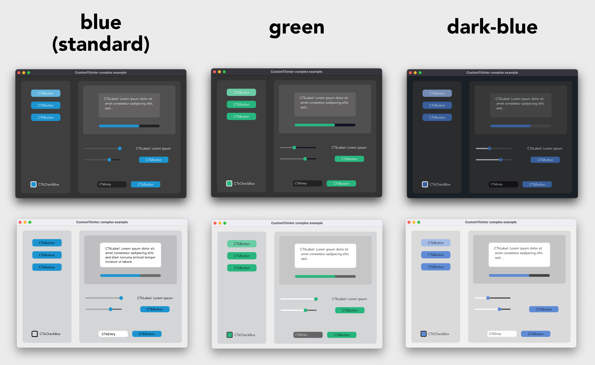
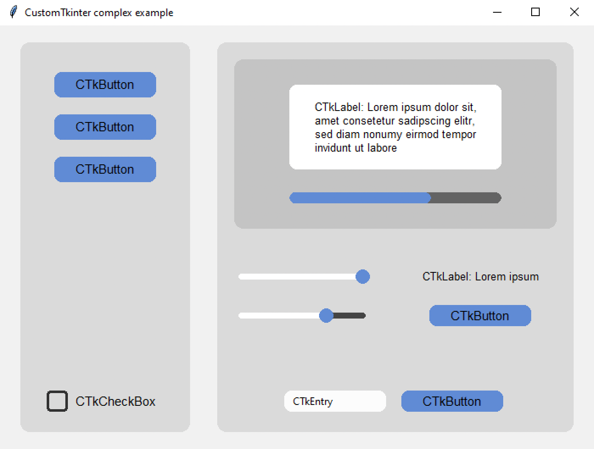
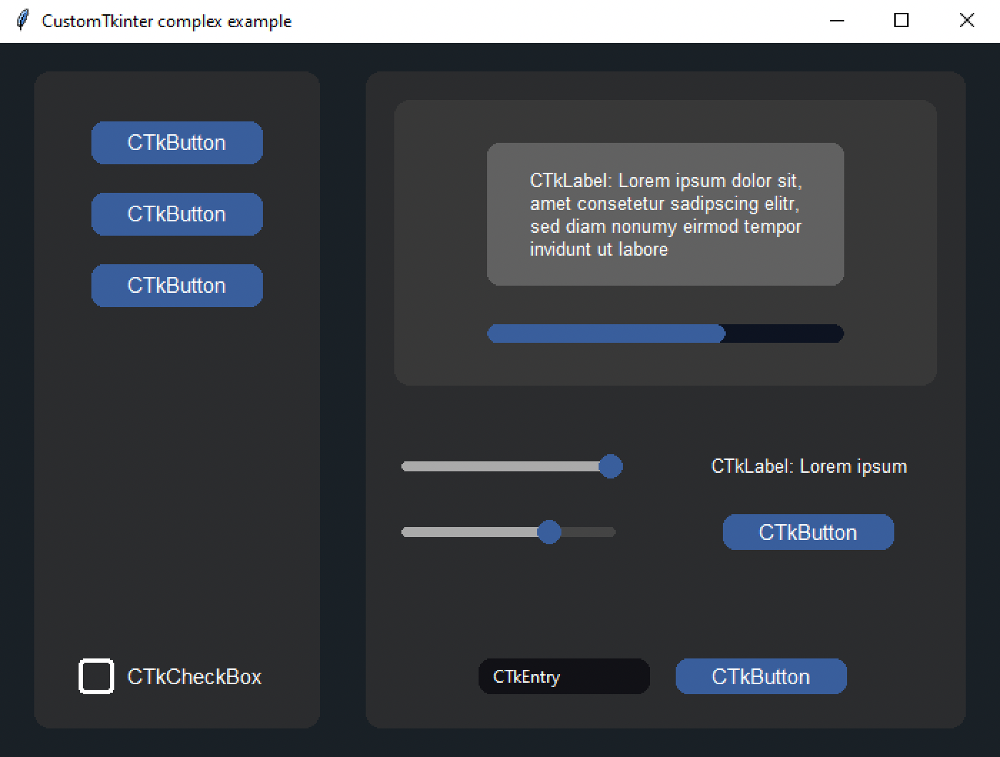
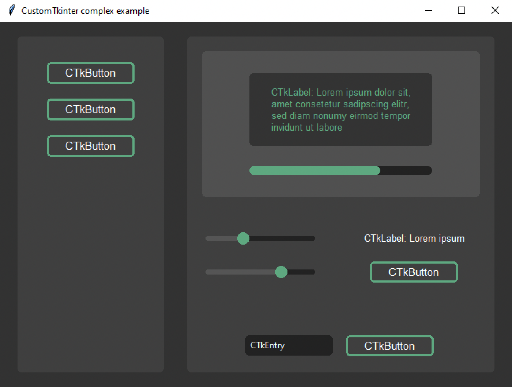

# CustomTkinter


With CustomTkinter you can create modern looking user
interfaces in python with tkinter. CustomTkinter is a
tkinter extension which provides extra ui-elements like
the CTkButton, which can be used like a normal tkinter.Button,
but can be customized with a border and round edges.

CustomTkinter also supports a light and dark theme,
which can either be set manually or get controlled by
the system appearance mode.

### Installation

To use CustomTkinter, just place the /customtkinter folder from this repository
next to your program, or **install the module with pip**:

```
pip3 install customtkinter
```
**Update existing installation:** ```pip3 install customtkinter --upgrade```\
(from time to time bugs are getting fixed and new features are added)

PyPI: https://pypi.org/project/customtkinter/

### Example program (simple button):
To test customtkinter you can try this simple example with only a single button:
```python
import tkinter
import customtkinter  # <- import the CustomTkinter module

root_tk = customtkinter.CTk()  # create CTk window like you do with the Tk window (tkinter.Tk has less functionality)
root_tk.geometry("400x240")
root_tk.title("CustomTkinter Test")

def button_function():
    print("button pressed")

# Use CTkButton instead of tkinter Button
button = customtkinter.CTkButton(master=root_tk, corner_radius=10, command=button_function)
button.place(relx=0.5, rely=0.5, anchor=tkinter.CENTER)

root_tk.mainloop()
```
which gives the following:


### Use custom colors and shapes:
If you dont specify any colors, customtkinter uses the standard blue color in the light theme.
You can change the color theme to dark by calling
```customtkinter.set_appearance_mode("Dark")```.
If you specify custom colors for CustomTkinter elements, the you can either use a
tuple in the form: (light_color, dark_color). Or you can set a single color
which will be used in light and dark theme.
```python
customtkinter.set_appearance_mode("Dark") # Other: "Light", "System"

button = customtkinter.CTkButton(master=root_tk,
                                 fg_color=("black", "lightgray"),  # <- tuple color for light and dark theme
                                 text="CTkButton",
                                 command=button_event)
button.place(relx=0.5, rely=0.5, anchor=tkinter.CENTER)
```

### Dark mode and dark title-bar on macOS
If you have a python version with Tcl/Tk >= 8.6.9, then you automatically get
a dark title bar with macOS dark-mode on, if you use the `customtkinter.Ctk` class to create
the window instead of the normal `tkinterTk` class. Currently, only the anaconda python versions have Tcl/Tk >= 8.6.9.
So if you want a dark window title-bar, you have to install anaconda python version
or miniconda.
```python
import tkinter
import customtkinter

customtkinter.set_appearance_mode("System")
root_tk = customtkinter.CTk()

... the program ...

root_tk.mainloop()
```

If you set the appearance mode to "System", it should change with
the System mode:


### Advanced example with multiple CTkFrames

Here I used the ``customtkinter.CTk()`` class to create the main window with two CTkFrame's and 
set the appearance mode to `System`. It has some
kind of a menu on the left side, and I used all CustomTkinter elements
there are at the moment.Maybe this is a good reference if you want to
create your own application with this library.
(Code: /complex_example.py)

With macOS dark-mode turned on, it looks like this:


But you can also customize it by yourself. Here I changed the main
colors and removed the round corners, and added a border to the buttons:



### Default color themes

If you don't set any colors at all you will get the standard blue
color theme.But you can also change the standard color theme to
green or dark-blue with the following command before you create
the main window:
```python
customtkinter.set_appearance_mode("System")
customtkinter.set_default_color_theme("dark-blue")  # Themes: "blue" (standard), "green", "dark-blue"
```
The color themes look like the following in light and dark mode:



### CustomTkinter on Windows/Linux

All elements of Customtkinter are drawn on the ```tkinter.Canvas```.
But the Tkinter canvas supports antialiasing only on macOS, so on Windows
and Linux the elements are rendered in a much worse quality. So you have
to experiment with the ```corner_radius``` and look when the rounded corners
look best. I tried to design the too complex example programs so that they
also look acceptable on Windows. Maybe you can use the parameters for
```corner_radius``` and ```width``` for your program as well.

Example 1:```examples/complex_example.py```





Example 2: ```examples/complex_example_custom_colors.py```



### CTkButton with images
It's also possible to put an image on a CTkButton. You just have to
pass a PhotoImage object to the CTkButton with the argument ``image``.
If you want no text at all you have to set ``text=""`` or with the ``compound``
option you can specify how to position both the text and image at once.
You can find an example program ( /simple_test_images.py ), where I
created two buttons with a bell and a settings image on them:


### Integration of TkinterMapView widget
In the following example I used a TkinterMapView which integrates
well with a CustomTkinter program. It's a tile based map widget which displays
OpenStreetMap or other tile based maps:


You can find the TkinterMapView library and the example program here:
https://github.com/TomSchimansky/TkinterMapView

# Documentation - CustomTkinter Elements

### CTk
You can use the normal ``tkinter.Tk`` class to create the root window,
but if you want a background color that changes with the appearance mode and a dark title-bar on macOS,
you should use the `customtkinter.CTk` class which behaves exactly like the normal Tk
class, except that you can also set a tuple color as bg color.

Example Code:

```python
root_tk = customtkinter.CTk()

... program ...

root_tk.mainloop()
```
<details>
<summary>Show all arguments and methods:</summary>

argument | value
--- | ---
bg_color or bg | tuple: (light_color, dark_color) or single color

CTk Methods:

```python
root_tk = customtkinter.CTk()
# configure bg color with single or tuple color
root_tk.configure(bg_color="gray20")
root_tk.configure(bg_color=(<light-mode color>, <dark-mode color>))
```
</details>

### CTkFrame
Example Code:
```python
frame = customtkinter.CTkFrame(master=root_tk,
                               width=200,
                               height=200,
                               corner_radius=10)
frame.place(relx=0.5, rely=0.5, anchor=tkinter.CENTER)
```
<details>
<summary>Show all arguments and methods:</summary>

argument | value
--- | ---
master | root, tkinter.Frame or CTkFrame
width | slider width in px
height | slider height in px
fg_color | forground color, tuple: (light_color, dark_color) or single color
bg_color | background color, tuple: (light_color, dark_color) or single color
</details>

### CTkButton
Examle Code:
```python
def button_event():
    print("button pressed")

button = customtkinter.CTkButton(master=root_tk,
                                 text="CTkButton",
                                 command=button_event,
                                 width=120,
                                 height=32,
                                 border_width=0,
                                 corner_radius=8)
button.place(relx=0.5, rely=0.5, anchor=tkinter.CENTER)
```
<details>
<summary>Show all arguments and methods:</summary>

argument | value
--- | ---
master | root, tkinter.Frame or CTkFrame
command | callback function
textvariable | tkinter.StringVar object to change text of button
text | string
width | button width in px
height | button height in px
corner_radius | corner radius in px
border_width | button border width in px
fg_color | forground color, tuple: (light_color, dark_color) or single color
bg_color | background color, tuple: (light_color, dark_color) or single color
border_color | border color, tuple: (light_color, dark_color) or single color
hover_color | hover color, tuple: (light_color, dark_color) or single color
text_color | text color, tuple: (light_color, dark_color) or single color
text_font | button text font, tuple: (font_name, size)
hover | enable/disable hover effect: True, False
image | put an image on the button, removes the text, must be class PhotoImage
compound | set image orientation if image and text are given ("top", "left", "bottom", "right")
state | tkinter.NORMAL (standard) or tkinter.DISABLED (not clickable, darker color)

CTkButton Methods:

```python
CTkButton.set_text(new_text)
CTkButton.set_image(new_image)
CTkButton.configure(text=new_text)
CTkButton.configure(bg_color=new_bg_color,
                    fg_color=new_fg_color,
                    hover_color=new_hover_color,
                    text_color=new_text_color)
CTkButton.configure(state=tkinter.DISABLED)
CTkButton.configure(state=tkinter.NORMAL)
button_state = CTkButton.state
```

</details>

### CTkLabel
Example Code:
```python
label = customtkinter.CTkLabel(master=root_tk,
                               text="CTkLabel",
                               width=120,
                               height=25,
                               corner_radius=8)
label.place(relx=0.5, rely=0.5, anchor=tkinter.CENTER)
```
<details>
<summary>Show all arguments and methods:</summary>

argument | value
--- | ---
master | root, tkinter.Frame or CTkFrame
variable | tkinter.StringVar object
text | string
width | label width in px
height | label height in px
corner_radius | corner radius in px
fg_color | forground color, tuple: (light_color, dark_color) or single color
bg_color | background color, tuple: (light_color, dark_color) or single color, None for transparent bg
text_color | label text color, tuple: (light_color, dark_color) or single color
text_font | label text font, tuple: (font_name, size)

CTkLabel Methods:

```python
CTkLabel.configure(text=new_text)
CTkLabel.configure(fg_color=new_fg_color,
                   bg_color=new_bg_color,
                   text_color=new_text_color)
```

</details>

### CTkEntry
Example Code:
```python
entry = customtkinter.CTkEntry(master=root_tk,
                               width=120,
                               height=25,
                               corner_radius=10)
entry.place(relx=0.5, rely=0.5, anchor=tkinter.CENTER)

text = entry.get()
```
<details>
<summary>Show all arguments and methods:</summary>

argument | value
--- | ---
master | root, tkinter.Frame or CTkFrame
variable | tkinter.StringVar object
width | entry width in px
height | entry height in px
corner_radius | corner radius in px
fg_color | forground color, tuple: (light_color, dark_color) or single color
bg_color | background color, tuple: (light_color, dark_color) or single color
text_color | entry text color, tuple: (light_color, dark_color) or single color
text_font | entry text font, tuple: (font_name, size)

CTkEntry Methods:

```python
CTkEntry.delete(...)  # standard tkinter Entry...
CTkEntry.insert(...)
text = CTkEntry.get()
```

</details>

### CTkCheckBox
Examle Code:

```python
checkbox = customtkinter.CTkCheckBox(master=root_tk,
                                     text="CTkCheckBox")
checkbox.place(relx=0.5, rely=0.5, anchor=tkinter.CENTER)
```
<details>
<summary>Show all arguments and methods:</summary>

argument | value
--- | ---
master | root, tkinter.Frame or CTkFrame
text | string
width | box width in px
height | box height in px
corner_radius | corner radius in px
border_width | box border width in px
fg_color | forground (inside) color, tuple: (light_color, dark_color) or single color
bg_color | background color, tuple: (light_color, dark_color) or single color
border_color | border color, tuple: (light_color, dark_color) or single color
hover_color | hover color, tuple: (light_color, dark_color) or single color
text_color | text color, tuple: (light_color, dark_color) or single color
text_font | button text font, tuple: (font_name, size)
hover | enable/disable hover effect: True, False
state | tkinter.NORMAL (standard) or tkinter.DISABLED (not clickable, darker color)

CTkCheckBox Methods:
```python
CTkCheckBox.get()  # 1 or 0 (checked or not checked)
CTkCheckBox.select()  # turns on checkbox
CTkCheckBox.deselect()  # turns off checkbox
CTkCheckBox.toggle()  # change check state of checkbox
CTkCheckBox.configure(text=new_text)
CTkCheckBox.configure(bg_color=new_bg_color,
                      fg_color=new_fg_color,
                      hover_color=new_hover_color,
                      text_color=new_text_color)
CTkCheckBox.configure(state=tkinter.DISABLED)
CTkCheckBox.configure(state=tkinter.NORMAL)
checkbox_state = CTkCheckBox.state
```

</details>

### CTkSlider
Example Code:
```python
def slider_event(value):
    print(value)

slider = customtkinter.CTkSlider(master=root_tk,
                                 width=160,
                                 height=16,
                                 border_width=5.5,
                                 from_=0,
                                 to=100,
                                 command=slider_event)
slider.place(relx=0.5, rely=0.5, anchor=tkinter.CENTER)
```
<details>
<summary>Show all arguments and methods:</summary>

argument | value
--- | ---
master | root, tkinter.Frame or CTkFrame
command | callback function, gest called when slider gets changed
variable | tkinter.IntVar or tkinter.DoubleVar object
width | slider width in px
height | slider height in px
from_ | lower slider value
to | upper slider value
number_of_steps | number of steps in which the slider can be positioned
border_width | space around the slider rail in px
fg_color | forground color, tuple: (light_color, dark_color) or single color
progress_color | tuple: (light_color, dark_color) or single color, colors the slider line before the round button and is set to fg_color by default
bg_color | background color, tuple: (light_color, dark_color) or single color
border_color | slider border color, normally transparent (None)
button_color | color of the slider button, tuple: (light_color, dark_color) or single color
button_hover_color | hover color, tuple: (light_color, dark_color) or single color

CTkSlider Methods:
```python
value = CTkSlider.get()
CTkSlider.set(value)
```

</details>

### CTkProgressBar
Example Code:
```python
progressbar = customtkinter.CTkProgressBar(master=root_tk,
                                           width=160,
                                           height=20,
                                           border_width=5)
progressbar.place(relx=0.5, rely=0.5, anchor=tkinter.CENTER)

progressbar.set(value)
```
<details>
<summary>Show all arguments and methods:</summary>

argument | value
--- | ---
master | root, tkinter.Frame or CTkFrame
width | slider width in px
height | slider height in px
border_width | border width in px
fg_color | forground color, tuple: (light_color, dark_color) or single color
bg_color | background color, tuple: (light_color, dark_color) or single color
border_color | slider border color, tuple: (light_color, dark_color) or single color
progress_color | progress color, tuple: (light_color, dark_color) or single color
</details>

### Special commands
Change appearance mode:
```python
customtkinter.set_appearance_mode("Light")
customtkinter.set_appearance_mode("Dark")
customtkinter.set_appearance_mode("System")

print(customtkinter.get_appearance_mode())
```

Set default color theme:
```python
customtkinter.set_default_color_theme("dark-blue")  # Themes: "blue" (standard), "green", "dark-blue"
```

Use macOS darkmode window style without using the `customtkinter.Ctk` class:
```python
customtkinter.enable_macos_darkmode()  # get darkmode window style

 ... program ...

customtkinter.disable_macos_darkmode()  # disable darkmode (very important!)
```
