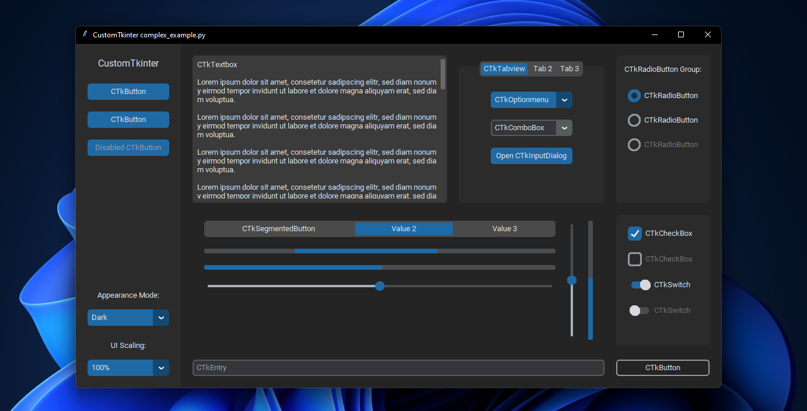
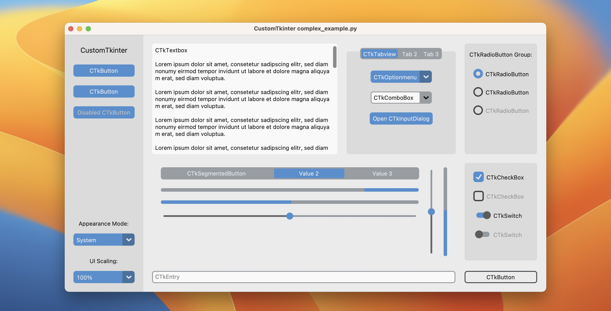
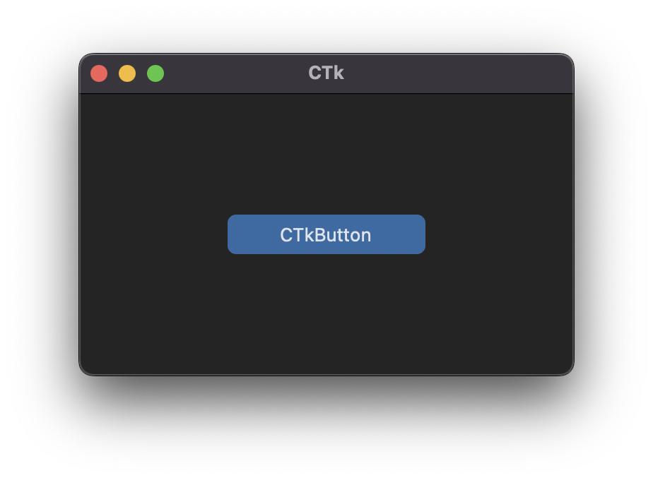
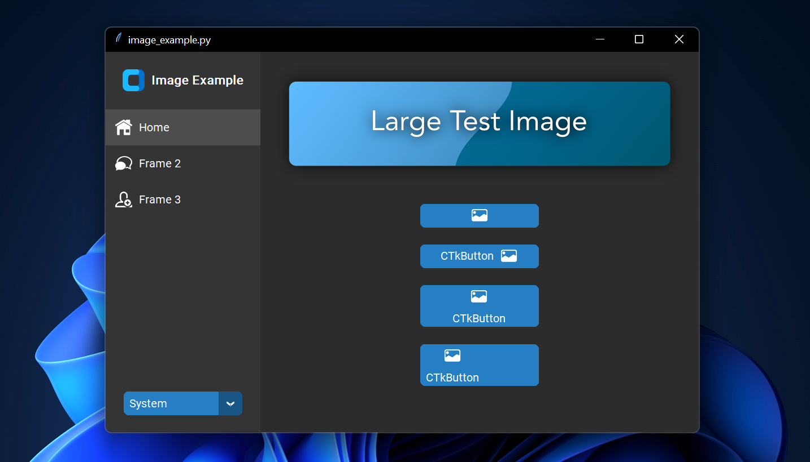
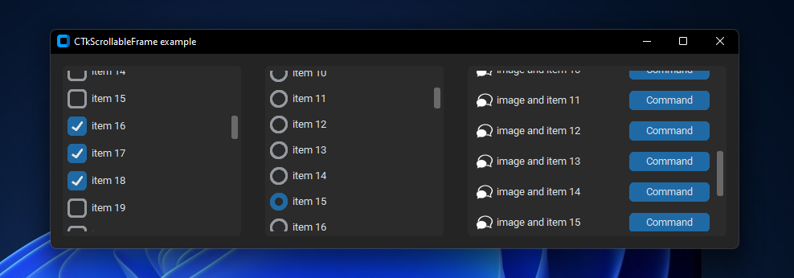

<p align="center">
  <picture>
    <source media="(prefers-color-scheme: dark)" srcset="./documentation_images/CustomTkinter_logo_dark.png">
    
  </picture>
</p>

<div align="center">


</div>

---

<div align="center">
<a href="https://www.paypal.com/donate/?hosted_button_id=LK5QAZYRN2R2A"></a>
<h3>
Official website: https://customtkinter.tomschimansky.com
</h3>
</div>

CustomTkinter is a python UI-library based on Tkinter, which provides new, modern and
fully customizable widgets. They are created and used like normal Tkinter widgets and
can also be used in combination with normal Tkinter elements. The widgets
and the window colors either adapt to the system appearance or the manually set mode
('light', 'dark'), and all CustomTkinter widgets and windows support HighDPI scaling
(Windows, macOS). With CustomTkinter you'll get a consistent and modern look across all
desktop platforms (Windows, macOS, Linux).


| _`complex_example.py` on Windows 11 with dark mode and 'blue' theme_


| _`complex_example.py` on macOS in light mode and standard 'blue' theme_
###


## Installation
Install the module with pip:
```
pip3 install customtkinter
```
**Update existing installation:** ```pip3 install customtkinter --upgrade```\
(update as often as possible because this library is under active development)

## Documentation

The **official** documentation can be found here:

**➡️ https://customtkinter.tomschimansky.com/documentation**.

## Example Program
To test customtkinter you can try this simple example with only a single button:
```python
import customtkinter

customtkinter.set_appearance_mode("System")  # Modes: system (default), light, dark
customtkinter.set_default_color_theme("blue")  # Themes: blue (default), dark-blue, green

app = customtkinter.CTk()  # create CTk window like you do with the Tk window
app.geometry("400x240")

def button_function():
    print("button pressed")

# Use CTkButton instead of tkinter Button
button = customtkinter.CTkButton(master=app, text="CTkButton", command=button_function)
button.place(relx=0.5, rely=0.5, anchor=customtkinter.CENTER)

app.mainloop()
```
which results in the following window on macOS:



In the [examples folder](https://github.com/TomSchimansky/CustomTkinter/tree/master/examples), you
can find more example programs and in the [Documentation](https://github.com/TomSchimansky/CustomTkinter/wiki)
you can find further information on the appearance mode, scaling, themes and all widgets.

## More Examples and Showcase

### Appearance mode change and scaling change

CustomTkinter can adapt to the Windows 10/11 light or dark mode:

https://user-images.githubusercontent.com/66446067/204672968-6584f360-4c52-434f-9c16-25761341368b.mp4

| _`complex_example.py` on Windows 11 with system appearance mode change and standard 'blue' theme_
###

On macOS you either need python3.10 or higher or the anaconda python
version to get a dark window header (Tcl/Tk >= 8.6.9 required):

https://user-images.githubusercontent.com/66446067/204673854-b6cbcfda-d9a1-4425-92a3-5b57d7f2fd6b.mp4

| _`complex_example.py` on macOS with system appearance mode change, user-scaling change and standard 'blue' theme_
###

### Button with images
It's possible to put an image on a CTkButton. You just have to
pass a PhotoImage object to the CTkButton with the ``image`` argument.
If you want no text at all you have to set ``text=""`` or you specify
how to position the text and image at once with the ``compound`` option:


| _`image_example.py` on Windows 11_
###

### Scrollable Frames
Scrollable frames are possible in vertical or horizontal orientation and can be combined
with any other widgets.

| _`scrollable_frame_example.py` on Windows 11_

### Integration of TkinterMapView widget
In the following example I used a TkinterMapView which integrates
well with a CustomTkinter program. It's a tile based map widget which displays
OpenStreetMap or other tile based maps:

https://user-images.githubusercontent.com/66446067/204675835-1584a8da-5acc-4993-b4a9-e70f06fa14b0.mp4

| _`examples/map_with_customtkinter.py` from TkinterMapView repository on Windows 11_

You can find the TkinterMapView library and example program here:
https://github.com/TomSchimansky/TkinterMapView
