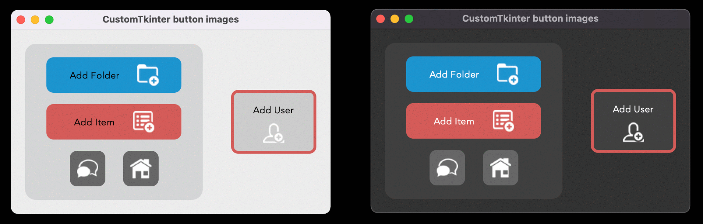

# CustomTkinter library


With CustomTkinter you can create modern looking user
interfaces in python with tkinter. CustomTkinter is a
tkinter extension which provides extra ui-elements like
the CTkButton, which can be used like a normal tkinter.Button,
but can be customized with a border and round edges.

CustomTkinter also supports a light and dark theme,
which can either be set manually or get controlled by
the system appearance mode.

### Installation

To use CustomTkinter, just place the /customtkinter folder from this repository
next to your program, or **install the module with pip**:

```
pip3 install customtkinter
```
**Update existing installation:** ```pip3 install customtkinter --upgrade```\
(from time to time bugs are getting fixed and new features are added)

### Documentation

A **detailed documentation** can be found **[here](https://github.com/TomSchimansky/CustomTkinter/wiki)**.

### Example program (simple button):
To test customtkinter you can try this simple example with only a single button:
```python
import tkinter
import customtkinter  # <- import the CustomTkinter module

root_tk = customtkinter.CTk()  # create CTk window like you do with the Tk window
root_tk.geometry("400x240")
root_tk.title("CustomTkinter Test")

def button_function():
    print("button pressed")

# Use CTkButton instead of tkinter Button
button = customtkinter.CTkButton(master=root_tk, corner_radius=10, command=button_function)
button.place(relx=0.5, rely=0.5, anchor=tkinter.CENTER)

root_tk.mainloop()
```
which gives the following:


### Use custom colors and shapes:
If you don't specify any colors, customtkinter uses the standard blue color theme in the light mode.
You can change the appearance mode to dark by calling
```customtkinter.set_appearance_mode("Dark")```.
If you specify custom colors for CustomTkinter elements, then you can either use a
tuple in the form: (light_color, dark_color). Or you can set a single color
which will be used in light and dark appearance mode.
```python
customtkinter.set_appearance_mode("Dark") # Other: "Light", "System"

button = customtkinter.CTkButton(master=root_tk,
                                 fg_color=("black", "lightgray"),  # <- tuple color for light and dark theme
                                 text="CTkButton",
                                 command=button_event)
button.place(relx=0.5, rely=0.5, anchor=tkinter.CENTER)
```

### Dark mode and dark title-bar on macOS
If you have a python version with Tcl/Tk >= 8.6.9, then you automatically get
a dark title bar with macOS dark-mode on, if you use the `customtkinter.Ctk` class to create
the window instead of the normal `tkinterTk` class. Currently, only the anaconda python versions have Tcl/Tk >= 8.6.9.
So if you want a dark window title-bar, you have to install anaconda python version
or miniconda.
```python
import tkinter
import customtkinter

customtkinter.set_appearance_mode("System")
root_tk = customtkinter.CTk()

... the program ...

root_tk.mainloop()
```

If you set the appearance mode to "System", it should change with
the System mode:


### Advanced example with multiple CTkFrames

Here I used the ``customtkinter.CTk()`` class to create the main window with two CTkFrame's and 
set the appearance mode to `System`. It has some
kind of a menu on the left side, and I used all CustomTkinter elements
there are at the moment. Maybe this is a good reference if you want to
create your own application with this library.
(Code: `examples/complex_example.py`)

With the green theme or the blue theme it looks like this:


### Default color themes

If you don't set any colors at all you will get the standard blue
color theme. But you can also change the standard color theme to
green or dark-blue with the following command before you create
the main window:
```python
customtkinter.set_appearance_mode("System")
customtkinter.set_default_color_theme("dark-blue")  # Themes: "blue" (standard), "green", "dark-blue"
```
The color themes look like the following in light and dark mode:


### CustomTkinter on Windows/Linux

All elements of Customtkinter are drawn on the ```tkinter.Canvas```.
But the Tkinter canvas supports antialiasing only on macOS (provided by the system), so on Windows
and Linux the elements are rendered in a much worse quality. So you have
to experiment with the ```corner_radius``` and decide when the rounded corners
look best. I tried to design the too complex example programs so that they
also look acceptable on Windows too. Maybe you can use the parameters for
```corner_radius``` and ```width``` for your program as well.

Example 1: ```examples/complex_example.py``` (light and dark mode)


In the following example I customized the elements with new colors, chnaged the corner_radius
and added a border to the button.

Example 2: ```examples/complex_example_custom_colors.py``` (dark mode)


### CTkButton with images
It's also possible to put an image on a CTkButton. You just have to
pass a PhotoImage object to the CTkButton with the argument ``image``.
If you want no text at all you have to set ``text=""`` or with the ``compound``
option you can specify how to position both the text and image at once.
You can find an example program ( /simple_test_images.py ), where I
created two buttons with a bell and a settings image on them:



### Integration of TkinterMapView widget
In the following example I used a TkinterMapView which integrates
well with a CustomTkinter program. It's a tile based map widget which displays
OpenStreetMap or other tile based maps:


You can find the TkinterMapView library and the example program here:
https://github.com/TomSchimansky/TkinterMapView
