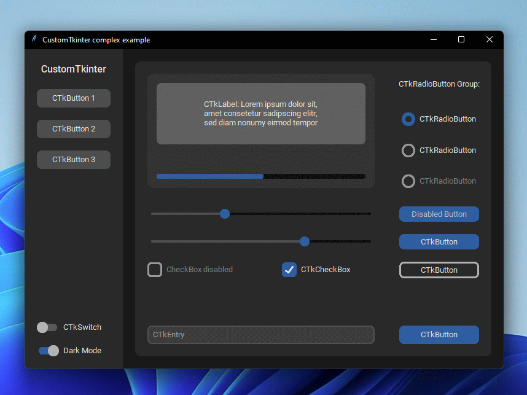

# CustomTkinter UI-Library


| _`complex_example.py` on Windows 11 with dark mode and 'dark-blue' theme_


| _`complex_example.py` on macOS in light mode and standard 'blue' theme_
###

CustomTkinter is a python UI-library based on Tkinter, which provides new, modern and
fully customizable widgets. They are created and used like normal Tkinter widgets and
can also be used in combination with normal Tkinter elements. The widgets
and the window colors either adapt to the system appearance or the manually set mode
('light', 'dark'), and all CustomTkinter widgets and windows support HighDPI scaling
(Windows, macOS). With CustomTkinter you'll get a consistent and modern look across all
desktop platforms (Windows, macOS, Linux).


## Installation
Install the module with pip:
```
pip3 install customtkinter
```
**Update existing installation:** ```pip3 install customtkinter --upgrade```\
(update as often as possible because this library is under active development)

## Documentation

The **official** documentation can be found in the Wiki Tab here:

**--> [Documentation](https://github.com/TomSchimansky/CustomTkinter/wiki)**.

## Example Program
To test customtkinter you can try this simple example with only a single button:
```python
import customtkinter

customtkinter.set_appearance_mode("System")  # Modes: system (default), light, dark
customtkinter.set_default_color_theme("blue")  # Themes: blue (default), dark-blue, green

app = customtkinter.CTk()  # create CTk window like you do with the Tk window
app.geometry("400x240")

def button_function():
    print("button pressed")

# Use CTkButton instead of tkinter Button
button = customtkinter.CTkButton(master=app, text="CTkButton", command=button_function)
button.place(relx=0.5, rely=0.5, anchor=customtkinter.CENTER)

app.mainloop()
```
which gives the following (macOS dark mode on):


In the [examples folder](https://github.com/TomSchimansky/CustomTkinter/tree/master/examples), you
can find more example programs and in the [Documentation](https://github.com/TomSchimansky/CustomTkinter/wiki)
you can find further information on the appearance mode, the themes and all widgets.

## More Examples and Showcase

### Appearance mode change

On Windows 10/11 you get a dark window header, which changes with set
appearance mode or the system, when you use `customtkinter.CTk()`
to create the window, and it works with all python versions:


| _`complex_example.py` on Windows 11 with system mode change and standard 'blue' theme_
###

On macOS however you either need python3.10 or higher or the anaconda python
version to get a dark window header at all (Tcl/Tk >= 8.6.9 required).


| _`complex_example.py` on macOS with system mode change and standard 'blue' theme_
###

### Button with images
It's possible to put an image on a CTkButton. You just have to
pass a PhotoImage object to the CTkButton with the ``image`` argument.
If you want no text at all you have to set ``text=""`` or you specify
how to position the text and image at once with the ``compound`` option:


| _`example_button_images.py` on macOS_
###

### Integration of TkinterMapView widget
In the following example I used a TkinterMapView which integrates
well with a CustomTkinter program. It's a tile based map widget which displays
OpenStreetMap or other tile based maps:


| _`examples/map_with_customtkinter.py` from TkinterMapView repository on macOS_

You can find the TkinterMapView library and the example program here:
https://github.com/TomSchimansky/TkinterMapView
